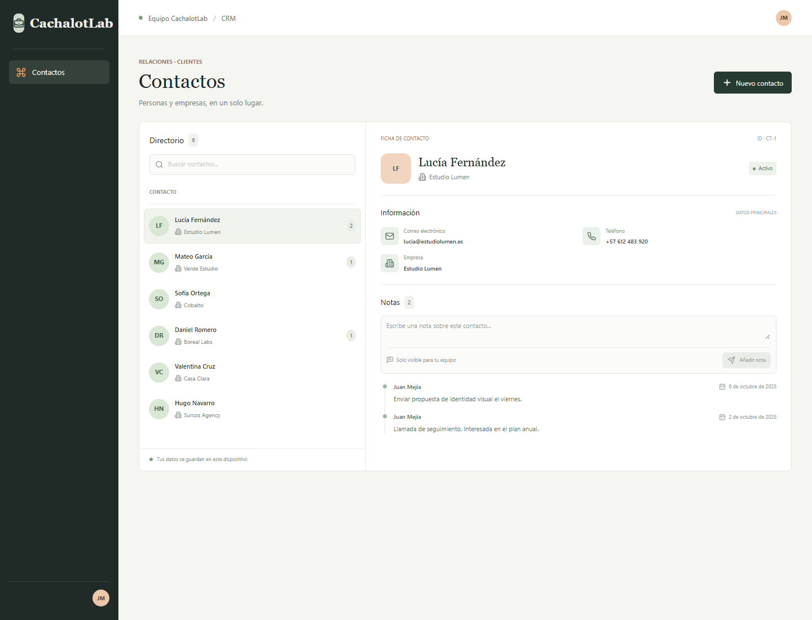
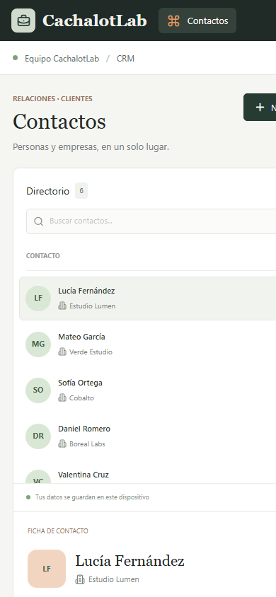

# CachalotLab CRM

Interfaz web para organizar contactos de clientes. Permite buscar personas por nombre o empresa, consultar sus datos, guardar notas y crear nuevos contactos.

Los datos se guardan en el navegador con `localStorage`.

## Capturas de pantalla

Guarda las capturas en `docs/recursos/` con estos nombres para que aparezcan aquí:

### Escritorio



### Celular



## Funcionalidades

- Lista de contactos con nombre, correo, teléfono y empresa.
- Búsqueda por nombre o empresa.
- Vista de detalle del contacto seleccionado.
- Creación de notas y consulta de notas anteriores.
- Formulario para crear contactos.
- Validación de nombre obligatorio y correo electrónico, con errores junto a cada campo.
- Estados de carga, lista vacía, búsqueda sin resultados y error.
- Guardado local de contactos y notas.

## Tecnologías

- React y JavaScript
- Vite
- Tailwind CSS y CSS
- Lucide React para los iconos

## Requisitos

- Node.js
- npm

## Instalación y ejecución

Abre una terminal en la carpeta del proyecto e instala las dependencias:

```bash
npm install
```

Inicia el servidor de desarrollo:

```bash
npm run dev
```

Abre la dirección que muestra Vite en la terminal. Normalmente es `http://localhost:5173`.

## Comandos disponibles

```bash
npm run dev      # Inicia el servidor de desarrollo
npm run lint     # Revisa problemas de estilo en el código
npm run build    # Genera la versión de producción en dist/
npm run preview  # Sirve localmente la versión compilada
```

Ejecuta `npm run build` antes de `npm run preview`.

## Cómo usar la aplicación

1. Selecciona un contacto para consultar su correo, teléfono, empresa y notas.
2. Escribe un nombre o una empresa en el buscador para filtrar la lista.
3. Para guardar una nota, escríbela en el detalle del contacto y pulsa **Añadir nota**.
4. Pulsa **Nuevo contacto**, completa el nombre y el correo, y selecciona **Crear contacto**.
5. Los contactos y las notas quedan guardados en el navegador actual.

## Estructura del proyecto

- `src/App.jsx`: punto de entrada de la interfaz.
- `src/components/CRMWorkspace.jsx`: organiza la página y conecta los componentes.
- `src/components/ContactList.jsx`: búsqueda, lista y estados vacíos o de error.
- `src/components/ContactDetail.jsx`: información y notas del contacto seleccionado.
- `src/components/ContactForm.jsx`: formulario y validación de contactos.
- `src/hooks/useContacts.js`: carga, actualización y guardado de datos.
- `src/data/contacts.js`: contactos y notas de ejemplo.
- `src/CRMStyles.css`: estilos de los componentes y diseño adaptable.
- `src/index.css`: estilos globales.
- `src/main.jsx`: montaje de React en el documento HTML.
- `index.html`: documento inicial de la aplicación.

## Decisiones de diseño

- En escritorio, la lista y el detalle se muestran juntos para facilitar la consulta.
- En celular, el contenido se organiza en una sola columna.
- Los controles tienen etiquetas, foco de teclado y mensajes de error visibles.
- Se combinan estilos propios con Tailwind para mantener un diseño sencillo y adaptable.
- `localStorage` permite conservar los cambios sin configurar un servidor.

## Uso de IA

Este proyecto se realizó con el apoyo de GitHub Copilot como herramienta de asistencia e investigación. Copilot ayudó a proponer y crear los datos de ejemplo y a implementar su guardado en `localStorage`. Después revisé, rectifiqué y validé el trabajo, adaptando las sugerencias a los requisitos del proyecto.
